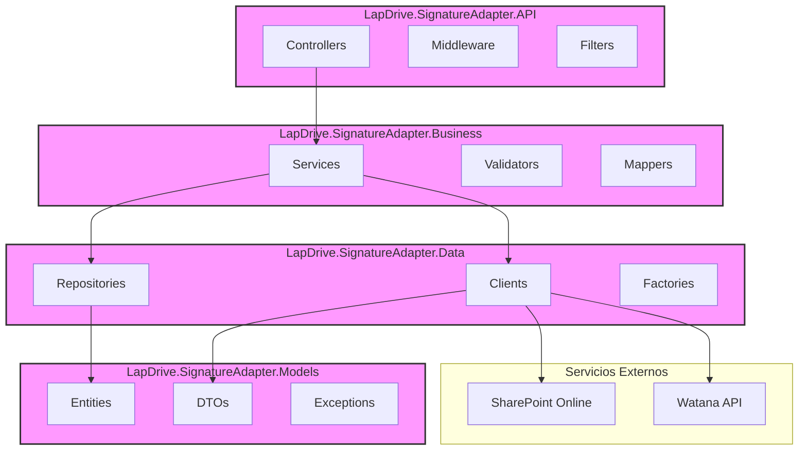
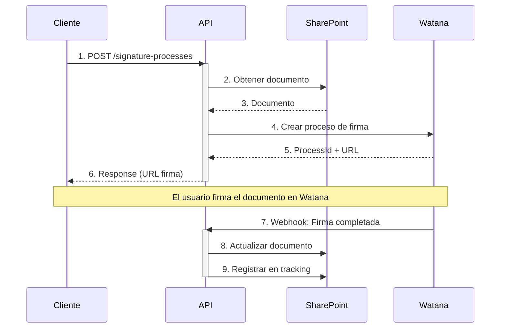

# LapDrive.SignatureAdapter

LapDrive.SignatureAdapter es una API que facilita la integración con proveedores de firma digital, permitiendo crear procesos de firma para documentos almacenados en SharePoint.

## Estructura del Proyecto

El proyecto implementa una arquitectura en capas con separación clara de responsabilidades:



### Descripción de Capas

- **LapDrive.SignatureAdapter.API**: Capa de presentación que expone los endpoints RESTful.
  - Controllers: Manejo de requests HTTP
  - Middleware: Procesamiento de autenticación, logging, y errores
  - Filters: Validación y transformación de requests

- **LapDrive.SignatureAdapter.Business**: Capa de lógica de negocio.
  - Services: Implementación de la lógica de negocio
  - Validators: Validación de modelos y reglas de negocio
  - Mappers: Transformación entre DTOs y entidades

- **LapDrive.SignatureAdapter.Data**: Capa de acceso a datos.
  - Repositories: Acceso a datos de SharePoint
  - Clients: Integración con APIs externas
  - Factories: Creación de objetos complejos

- **LapDrive.SignatureAdapter.Models**: Modelos compartidos.
  - Entities: Modelos de dominio
  - DTOs: Objetos de transferencia de datos
  - Exceptions: Excepciones personalizadas

## Requisitos

- .NET 8.0 SDK
- Acceso a SharePoint Online
- Credenciales de aplicación para SharePoint (ClientId, ClientSecret)
- Credenciales para el proveedor de firmas digitales (Watana)

## Configuración

La aplicación se configura mediante el archivo `appsettings.json`. Las siguientes secciones deben configurarse:

### SharePoint

```json
"SharePoint": {
  "ClientId": "00000000-0000-0000-0000-000000000000",
  "ClientSecret": "your-client-secret",
  "TenantId": "your-tenant-id.onmicrosoft.com",
  "SiteUrl": "https://yourtenant.sharepoint.com/sites/yoursite",
  "Tracking": {
    "ListName": "YourTrackingListName",
    "SiteUrl": "https://yourtenant.sharepoint.com/sites/dkmt365/firmas"
  }
}
```

### Proveedor de Firmas

```json
"SignatureProvider": {
  "ApiUrl": "https://api.watana.pe/api/v1/xxxxxxxx",
  "Token": "your-token-here",
  "Timeout": "00:10:00",
  "MaxRetries": 3,
  "Templates": {
    "SignatureText": "Firmado por: <FIRMANTE>...",
    "SignatureReason": "Firma Digital"
  },
  "Status": {
    "Signed": "firmado",
    "Rejected": "rechazado-por-firmante",
    "InProcess": "en-proceso",
    "Waiting": "en-espera"
  }
}
```

### Logging (Serilog)

```json
"Serilog": {
  "MinimumLevel": {
    "Default": "Information",
    "Override": {
      "Microsoft": "Warning",
      "Microsoft.Hosting.Lifetime": "Information"
    }
  },
  "WriteTo": [
    {
      "Name": "Console",
      "Args": {
        "outputTemplate": "[{Timestamp:HH:mm:ss} {Level:u3}] {Message:lj}{NewLine}{Exception}"
      }
    },
    {
      "Name": "File",
      "Args": {
        "path": "logs/lapdrive-signature-adapter.log",
        "rollingInterval": "Day"
      }
    }
  ]
}
```

### API

```json
"Api": {
  "Title": "LapDrive Signature Adapter API",
  "Version": "v1",
  "Description": "API for digital signature processes",
  "Contact": {
    "Name": "Development Team",
    "Email": "dev@lapperu.com"
  }
}
```
## Flujo de Proceso de Firma

El siguiente diagrama muestra el flujo completo de un proceso de firma digital, incluyendo la interacción entre los diferentes componentes del sistema:



### Estados del Proceso

1. **Inicio**: Cliente envía documento para firma
2. **Preparación**: API obtiene documento de SharePoint
3. **Creación**: Se crea proceso en Watana
4. **En Proceso**: Documento pendiente de firmas
5. **Finalizado**: Todas las firmas completadas
6. **Cancelado**: Proceso cancelado manualmente
7. **Error**: Fallo en algún paso del proceso

## API Endpoints
## API Endpoints

### POST /api/v1/signature-processes

Crea un nuevo proceso de firma digital para un documento o carpeta almacenada en SharePoint.

#### Request

```json
{
  "requestId": "string",
  "metadata": {
    "subject": "string",
    "message": "string",
    "createdAt": "2025-03-27T12:00:00Z"
  },
  "document": {
    "id": "string",
    "name": "string",
    "libraryName": "string",
    "webUrl": "string",
    "type": "file"
  },
  "signers": [
    {
      "displayName": "string",
      "email": "string",
      "signature": {
        "x": 0,
        "y": 0,
        "pageNumber": 1,
        "position": "string"
      }
    }
  ],
  "recipients": [
    {
      "displayName": "string",
      "email": "string"
    }
  ]
}
```

#### Response

```json
{
  "processId": "string",
  "status": "string",
  "message": "string",
  "signingUrl": "string"
}
```

### GET /api/v1/signature-processes/{id}

Obtiene el estado y detalles de un proceso de firma digital específico.

#### Response

```json
{
  "processId": "string",
  "status": "string",
  "message": "string",
  "signingUrl": "string",
  "document": {
    "id": "string",
    "name": "string",
    "libraryName": "string",
    "webUrl": "string"
  },
  "signers": [
    {
      "email": "string",
      "status": "string",
      "signedAt": "2025-03-27T12:00:00Z"
    }
  ]
}
```

### DELETE /api/v1/signature-processes/{id}

Cancela un proceso de firma digital en curso.

#### Response

* Status 204: El proceso fue cancelado exitosamente
* Status 404: El proceso no existe
* Status 400: El proceso no puede ser cancelado (por ejemplo, si ya está finalizado)

## Desarrollo

### Entornos

La aplicación soporta múltiples entornos de ejecución:

- **Development**: Entorno local de desarrollo con Swagger UI habilitado
- **Staging**: Entorno de pruebas
- **Production**: Entorno de producción

Para ejecutar en un entorno específico:

```bash
dotnet run --project LapDrive.SignatureAdapter.API --environment Development
```

### Compilación

```bash
dotnet build
```

### Ejecución

```bash
# Ejecución normal
dotnet run --project LapDrive.SignatureAdapter.API

# Ejecución con hot reload para desarrollo
dotnet watch run --project LapDrive.SignatureAdapter.API
```

### Pruebas

```bash
# Ejecutar todas las pruebas
dotnet test

# Ejecutar pruebas con cobertura
dotnet test /p:CollectCoverage=true /p:CoverletOutputFormat=opencover
```

### Depuración

1. En Visual Studio Code:
   - Abrir el proyecto
   - Presionar F5 o ir a Run > Start Debugging
   - Seleccionar ".NET Core Launch (web)"

2. Usando los logs:
   - Los logs se encuentran en `logs/lapdrive-signature-adapter.log`
   - Rotan diariamente
   - Incluyen stack traces completos para excepciones

### Troubleshooting Común

1. **Error de conexión con SharePoint**
   - Verificar que el ClientId y ClientSecret sean válidos
   - Confirmar que la URL del sitio sea accesible
   - Revisar los permisos de la aplicación en Azure AD

2. **Error en proceso de firma**
   - Validar que el token del proveedor esté vigente
   - Verificar que el documento esté en formato PDF
   - Comprobar que las coordenadas de firma sean válidas

3. **Problemas de rendimiento**
   - Revisar la configuración de Timeout
   - Verificar la configuración de MaxRetries
   - Monitorear los logs de tiempos de respuesta

## Extensibilidad

El sistema está diseñado para permitir el cambio de proveedor de firmas digitales en el futuro. Esto se logra mediante:

1. Interfaces de abstracción en la capa de datos
2. DTOs agnósticos al proveedor
3. Modelo de dominio independiente de los detalles de implementación

Para cambiar el proveedor de firmas, se debe implementar la interfaz `ISignatureProviderClient` y actualizar el registro en la inyección de dependencias.

## Dependencias Principales

- **FluentValidation** (v11.11.0): Validación de modelos y DTOs
- **Microsoft.AspNetCore.OpenApi** (v8.0.4): Soporte para OpenAPI/Swagger
- **Serilog** (v9.0.0): Logging estructurado
- **Swashbuckle** (v8.0.0): Documentación de API con Swagger

## Seguridad

### Autenticación

La API utiliza autenticación basada en tokens para todos los endpoints. Se requiere incluir el token en el header de la siguiente manera:

```
Authorization: Bearer <your-token>
```

### CORS

La configuración de CORS permite solicitudes desde dominios específicos:
- Origen permitido: `https://yourdomain.com`
- Métodos permitidos: Todos
- Headers permitidos: Todos

## Monitoreo

### Métricas y Logs

1. **Logs estructurados**
   - Ubicación: `logs/lapdrive-signature-adapter.log`
   - Formato: JSON estructurado
   - Rotación: Diaria

2. **Métricas clave**
   - Tiempo de respuesta de endpoints
   - Tasa de éxito/error en procesos de firma
   - Estado de conexión con SharePoint y proveedor de firmas

### Healthchecks

Endpoint de salud: `GET /health`
- Verifica conexión con SharePoint
- Verifica conexión con proveedor de firmas
- Verifica acceso a almacenamiento

## Guía de Contribución

1. **Convenciones de código**
   - Usar C# latest features (.NET 8)
   - Seguir principios SOLID
   - Documentar APIs con XML comments

2. **Proceso de desarrollo**
   - Crear branch desde `develop`
   - Seguir formato de commits convencional
   - Crear PR con descripción detallada

3. **Pruebas requeridas**
   - Unitarias (cobertura >80%)
   - Integración
   - E2E para flujos críticos

## CI/CD

El proyecto utiliza Azure DevOps para CI/CD:

1. **Build Pipeline**
   - Compilación
   - Pruebas unitarias
   - Análisis de código
   - Generación de artefactos

2. **Release Pipeline**
   - Deploy a Development
   - Deploy a Staging
   - Deploy a Production

## Licencia

Derechos Reservados © 2025